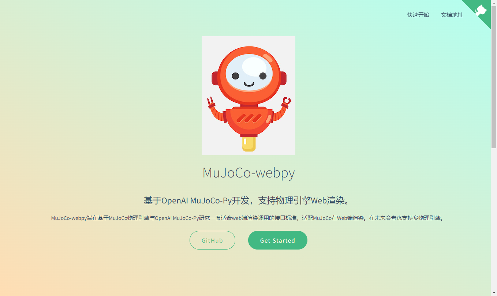

参与共计5项项目。

### 2020-2023 底层研究：稀疏矩阵运算优化

    研究了
     - 算法1
     - 模型1 

### 2020-2023 应用示范：国家电网-新能源光伏功率预测

    提出了
     - 算法1
     - 模型1   

### 2019-2020 平台建设：基于交互式模拟器的强化学习平台

    开发了mujoco-webpy工具，MuJoCo-webpy旨在基于MuJoCo物理引擎与OpenAI MuJoCo-Py研究一套适合web端渲染调用的接口标准，适配MuJoCo在Web端渲染。
    
[MuJoCo-Webpy主页](https://yaotc.github.io/mujoco-webpy/#/)

### 2018-2019 应用研究： 基于深度学习的指纹识别算法研究

    开发了基于双流法的指纹比对模型。

### 2017-2018 应用研究： 基于深度学习的医学影像处理技术

    开发了基于快速离散小波变换的心脏核磁共振影像的成像算法。计算结果表明，采用80×150×32×80心脏MRI数据集，在心脏核磁共振影像重建过程中，快速离散小波变换的速度大约是常规DWT(discrete wavelet transform)的3倍；基于快速离散小波变换的心脏核磁共振影像的成像算法比基于常规离散小波变换的心脏核磁共振影像的成像算法快约20%。
